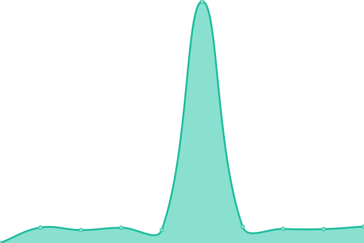
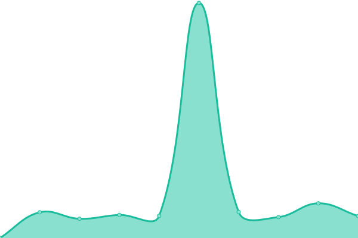

# [📈 Live Status](https://hugaf.github.io/monitoring): <!--live status--> **🟧 Partial outage**

This repository contains the open-source uptime monitor and status page for [Hugaf](https://hugaf.com), powered by [Upptime](https://github.com/upptime/upptime).

With [Upptime](https://upptime.js.org), you can get your own unlimited and free uptime monitor and status page, powered entirely by a GitHub repository. We use [Issues](https://github.com/hugaf/monitoring/issues) as incident reports, [Actions](https://github.com/hugaf/monitoring/actions) as uptime monitors, and [Pages](https://hugaf.github.io/monitoring) for the status page.

<!--start: status pages-->
<!-- This summary is generated by Upptime (https://github.com/upptime/upptime) -->
<!-- Do not edit this manually, your changes will be overwritten -->
<!-- prettier-ignore -->
| URL | Status | History | Response Time | Uptime |
| --- | ------ | ------- | ------------- | ------ |
|  [vClaim Bridging Server](https://hugaf.rumkitalmerauke.com/simrs/jknmobile/hugaf/vclaim) | 🟥 Down | [v-claim-bridging-server.yml](https://github.com/hugaf/monitoring/commits/HEAD/history/v-claim-bridging-server.yml) | 

 1171ms
     
 | 

<a href="https://hugaf.github.io/monitoring/history/v-claim-bridging-server">54.89%</a>
    

|  [vClaim Web (https://vclaim.bpjs-kesehatan.go.id/vclaim)](https://vclaim.bpjs-kesehatan.go.id/VClaim/) | 🟥 Down | [v-claim-web-https-vclaim-bpjs-kesehatan-go-id-vclaim.yml](https://github.com/hugaf/monitoring/commits/HEAD/history/v-claim-web-https-vclaim-bpjs-kesehatan-go-id-vclaim.yml) | 

 0ms
     
 | 

<a href="https://hugaf.github.io/monitoring/history/v-claim-web-https-vclaim-bpjs-kesehatan-go-id-vclaim">100.00%</a>
    

|  [SatuSehat Bridging Server](https://api-satusehat.kemkes.go.id/kyc/v1/validation-web/) | 🟩 Up | [satu-sehat-bridging-server.yml](https://github.com/hugaf/monitoring/commits/HEAD/history/satu-sehat-bridging-server.yml) | 

 1671ms
     
 | 

<a href="https://hugaf.github.io/monitoring/history/satu-sehat-bridging-server">100.00%</a>
    

|  [SIMRS Rumkital Merauke (CLOUD SERVER)](https://hugaf.rumkitalmerauke.com/simrs/jknmobile/) | 🟥 Down | [simrs-rumkital-merauke-cloud-server.yml](https://github.com/hugaf/monitoring/commits/HEAD/history/simrs-rumkital-merauke-cloud-server.yml) | 

 1934ms
     
 | 

<a href="https://hugaf.github.io/monitoring/history/simrs-rumkital-merauke-cloud-server">54.48%</a>
    

|  [Hugaf](https://hugaf.com) | 🟩 Up | [hugaf.yml](https://github.com/hugaf/monitoring/commits/HEAD/history/hugaf.yml) | 

 1078ms
     
 | 

<a href="https://hugaf.github.io/monitoring/history/hugaf">100.00%</a>
    

<!--end: status pages-->

[**Visit our status website →**](https://hugaf.github.io/monitoring)

## 📄 License

- Powered by: [Upptime](https://github.com/upptime/upptime)
- Code: [MIT](./LICENSE) © [Anand Chowdhary](https://anandchowdhary.com), supported by [Pabio](https://pabio.com)
- Data in the `./history` directory: [Open Database License](https://opendatacommons.org/licenses/odbl/1-0/)
